# 🌌 CORE WORKSPACE INTELLIGENCE & INTERACTIVE GALAXY COSMOS

<p align="center">
  <!-- Gorgeous local CSS-Animated Banner -->
  
</p>

<p align="center">
  <!-- Safe Self-Contained Local Typing Animation -->
  
</p>

<p align="center">
  <!-- Bulletproof, high-contrast structural shields.io badges -->
  
  
  
  
</p>

---

## 📖 Cockpit Introduction

Welcome, **Fahad**. This is your exclusive, high-fidelity technical workstation catalog and cognitive file auditor. Featuring a beautiful interactive **WebGL stardust galaxy** that binds to your local file tree directories dynamically using **Three.js** and ambient layout controls.

The workspace is pre-aligned with a premium **Voice-Activated Interaction Suite**:
*   🎙️ **Natural Speech Capture** via local speech recognition to translate your spoken commands instantly into markdown queries.
*   🔊 **Baritone Vocalizer** executing on a refined mathematical pitch system. It reads all server analytical responses back in a deep, clean male voice, prefixing security context alerts directly to you, **Sir**.

---

## ⚡ Station Telemetry & Status Indicators

```text
 🛡️ INTEGRITY: SECURE       📡 NET: CONTAINER INGRESS [PORT 3000]       🎙️ AUDIO CHANNEL: READY
 👤 HOST IDENTIFIER: FAHAD  🧬 PLATFORM CORE: HYBRID TS/PYTHON ANYWHERE  ⚙️ BACKEND COGNITION: OPERATIONAL
```

---

## 📊 Cognitive Performance Workspace

<p align="center">
  <!-- Static fully-formed badges with gorgeous high-performance indicators -->
  
  
  
</p>

---

## 🎵 Cosmic Workspace Lounge (Currently Streaming)

<p align="center">
  <!-- Beautiful local animated music stream visualizer -->
  
</p>

---

## 🛠️ Dynamic Navigation Tree & Workspace Systems

Below is the nested architecture of Fahad's Interactive Station. Click on any section below to reveal deeper structural operations:

<details>
<summary>📂 View Node File Catalogue Mapping</summary>

```text
/ (Project Root)
├── app.py                  <-- Dual-stack PythonAnywhere API engine & LLM gateway
├── server.ts               <-- TypeScript Fast/Dev express server routing
├── package.json            <-- Static build script boundaries & dependency requirements
├── vite.config.ts          <-- Front-bundler parameters
├── tsconfig.json           <-- Compiler parameter guidelines
└── src/
    ├── main.tsx            <-- UI application mounting node
    ├── index.css           <-- Custom glowing canvas animations & tailwind utilities
    ├── App.tsx             <-- Primary desktop layout, microphone recognition & speech synthesizers
    └── components/
        └── ThreeTree.tsx   <-- WebGL Three.js interactive stardust starfields generator
```
</details>

<details>
<summary>⚡ View Local CLI Command Reference Guide</summary>

For typical maintenance or terminal execution, use the simple package hooks:

### Launch Local Server
```bash
npm run dev
```

### Bundle Frontend for Deployment
```bash
npm run build
```

### Strict Lint Assessment
```bash
npm run lint
```
</details>

---

## 🐍 Comprehensive PythonAnywhere.com Deploy Guide (For Fahad)

This workstation is fully dual-stack ready. To take this workspace application live on **PythonAnywhere.com** under your customized domain/subdomain, follow this strict, granular step-by-step procedure:

<details>
<summary>🚀 Step 1: Bundling Frontend Assets locally</summary>

The backend Flask server (`app.py`) serves pre-compiled and optimized React components. We must bundle it first:
1. Open your workspace terminal.
2. Run the production build command:
   ```bash
   npm run build
   ```
3. This creates a highly optimized, fully self-contained folder `/dist` in your root directory containing `index.html` and pre-rendered JS/styling bundles.
</details>

<details>
<summary>📦 Step 2: Packaging the Archive</summary>

To easily upload your complete codebase to PythonAnywhere:
1. Compress your workspace directory into a unified `.zip` archive file. 
2. Ensure you package the following files:
   * `/dist`
   * `app.py`
   * `metadata.json`
3. *Note:* Ignore `node_modules` and `.git` folders to ensure the uploaded ZIP remains small and fast to transmit.
</details>

<details>
<summary>💾 Step 3: Server File Upload & Script Extraction</summary>

1. Log into your **PythonAnywhere dashboard**.
2. Click the **Files** tab on top.
3. Create a folder named `/home/fahadgroyne/personal-workspace`.
4. Upload your `.zip` archive file inside this directory.
5. Launch a new **Bash Console** in your PythonAnywhere console drawer, and run these extraction parameters:
   ```bash
   cd /home/fahadgroyne/personal-workspace
   unzip <your-zip-name>.zip
   pip install flask flask-cors
   ```
</details>

<details>
<summary>⚙️ Step 4: Python Web Container Alignment</summary>

1. Open the **Web** tab in PythonAnywhere.
2. Click **Add a new web app**.
3. Choose **Manual Configuration** (Do not choose Flask to avoid system boilerplate overrides!).
4. Select **Python 3.10** or higher as the active runtime.
5. In the settings page, adjust:
   * **Source code path:** `/home/fahadgroyne/personal-workspace`
   * **Working directory:** `/home/fahadgroyne/personal-workspace`
</details>

<details>
<summary>🔑 Step 5: WSGI Alignment & Setting Gemini Secret Keys</summary>

PythonAnywhere routes incoming web transactions via the WSGI controller:
1. Under your web settings panel, click the link to your **WSGI configuration file** (e.g. `/var/www/username_wsgi.py`).
2. Erase the pre-populated template content entirely, and paste the following strict configuration block:

```python
import sys
import os

# Define absolute workspace node directory
path = '/home/fahadgroyne/personal-workspace'
if path not in sys.path:
    sys.path.insert(0, path)

# Configure vital system environment factors
os.environ['NODE_ENV'] = 'production'
os.environ['GEMINI_API_KEY'] = 'YOUR_SECRET_GEMINI_API_KEY_HERE'

# Import local Flask API routing engine
from app import app as application
```

3. Replace `'YOUR_SECRET_GEMINI_API_KEY_HERE'` with your real Gemini API key, click **Save** in the top bar, and navigate back to the PythonAnywhere **Web** tab.
</details>

<details>
<summary>✨ Step 6: Power On & Launch Verification</summary>

1. Scroll to the top of your **Web** tab settings.
2. Click the large green **Reload <yourdomain>** button.
3. Direct your browser address bar to your URL: `https://fahadgroyne.pythonanywhere.com`
4. **Mission Accomplished!** Your custom 3D webGL workstation, vocal feedback engine, and failover API chain are fully armed and ready.
</details>

---

<p align="center" style="font-family: monospace; font-size: 11px; color: #475569;">
  🌌 Station crafted specifically under security vectors designated for Mr. Fahad. All digital rights reserved.
</p>
